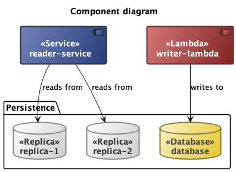

# temporal-diagrams
A Scala DSL for generating diagram variants

## In action

Easily generate diagrams


Or variants of them


Even to different diagram languages



With complex targeting


Or highlighting certain areas


## Features

- Encode to one or more target diagram languages
- Write in type safe DSLs for target diagram languages
- Mix multiple domain languages in one diagram
- Highlight certain areas of a diagram with highlighting

## Supported target languages

- :white_check_mark: [Mermaid](docs/mermaid.md)
- :white_check_mark: [PlantUML](docs/plantuml.md)

## See also

- [Architecture](/docs/architecture.md)

## Unmanaged JAR

Copy the URL from [the PlantUML download page](https://plantuml.com/download)

```bash
(cd YOUR_SBT_SUB_PROJECT/lib && curl -LO https://github.com/plantuml/plantuml/releases/download/v1.2023.13/plantuml-mit-1.2023.13.jar)
```

`-L` means follow redirects and `-O` means save the payload

## Generating very large diagrams

[Inject the override via environment variable](https://plantuml.com/faq)

```
PLANTUML_LIMIT_SIZE=8192 sbt run
```

## Elsewhere

- https://crashedmind.github.io/PlantUMLHitchhikersGuide/layout/layout.html
