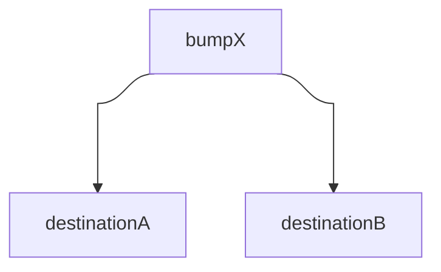
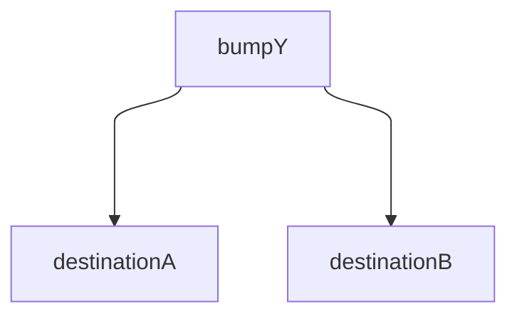
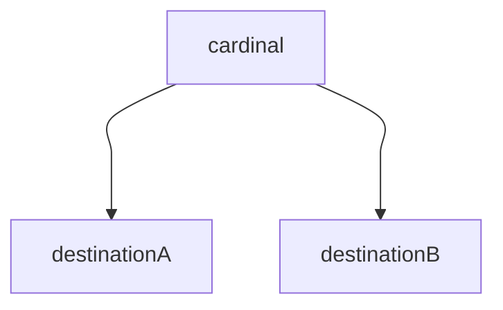
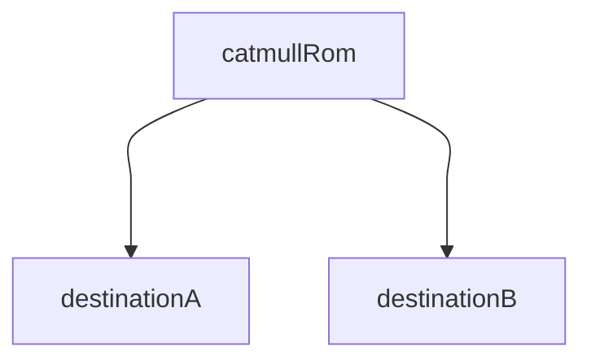
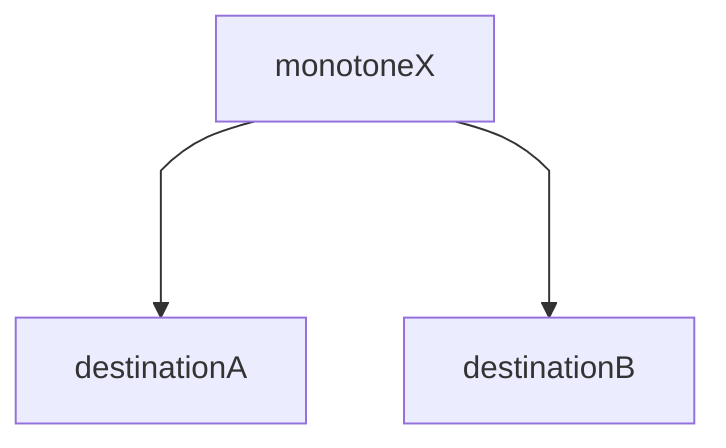
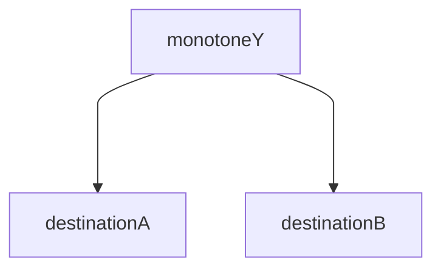
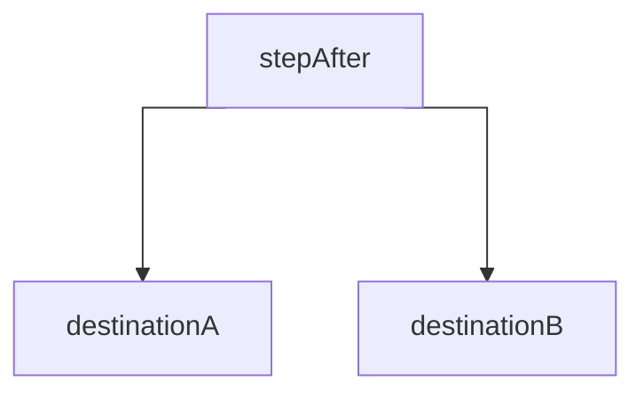
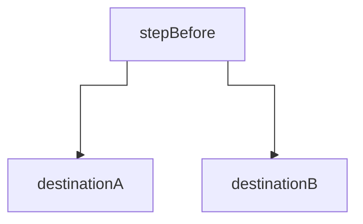

```mermaid
---
config:
  flowchart:
    curve: basis
---
flowchart
  destinationA
  destinationB
  source[basis]
  source ---> destinationA
  source ---> destinationB
```

```mermaid
---
config:
  flowchart:
    curve: bumpX
---
flowchart
  destinationA
  destinationB
  source[bumpX]
  source ---> destinationA
  source ---> destinationB
```

```mermaid
---
config:
  flowchart:
    curve: bumpY
---
flowchart
  destinationA
  destinationB
  source[bumpY]
  source ---> destinationA
  source ---> destinationB
```

```mermaid
---
config:
  flowchart:
    curve: cardinal
---
flowchart
  destinationA
  destinationB
  source[cardinal]
  source ---> destinationA
  source ---> destinationB
```

```mermaid
---
config:
  flowchart:
    curve: catmullRom
---
flowchart
  destinationA
  destinationB
  source[catmullRom]
  source ---> destinationA
  source ---> destinationB
```

```mermaid
---
config:
  flowchart:
    curve: linear
---
flowchart
  destinationA
  destinationB
  source[linear]
  source ---> destinationA
  source ---> destinationB
```

```mermaid
---
config:
  flowchart:
    curve: monotoneX
---
flowchart
  destinationA
  destinationB
  source[monotoneX]
  source ---> destinationA
  source ---> destinationB
```

```mermaid
---
config:
  flowchart:
    curve: monotoneY
---
flowchart
  destinationA
  destinationB
  source[monotoneY]
  source ---> destinationA
  source ---> destinationB
```

```mermaid
---
config:
  flowchart:
    curve: natural
---
flowchart
  destinationA
  destinationB
  source[natural]
  source ---> destinationA
  source ---> destinationB
```

```mermaid
---
config:
  flowchart:
    curve: step
---
flowchart
  destinationA
  destinationB
  source[step]
  source ---> destinationA
  source ---> destinationB
```

```mermaid
---
config:
  flowchart:
    curve: stepAfter
---
flowchart
  destinationA
  destinationB
  source[stepAfter]
  source ---> destinationA
  source ---> destinationB
```

```mermaid
---
config:
  flowchart:
    curve: stepBefore
---
flowchart
  destinationA
  destinationB
  source[stepBefore]
  source ---> destinationA
  source ---> destinationB
```
